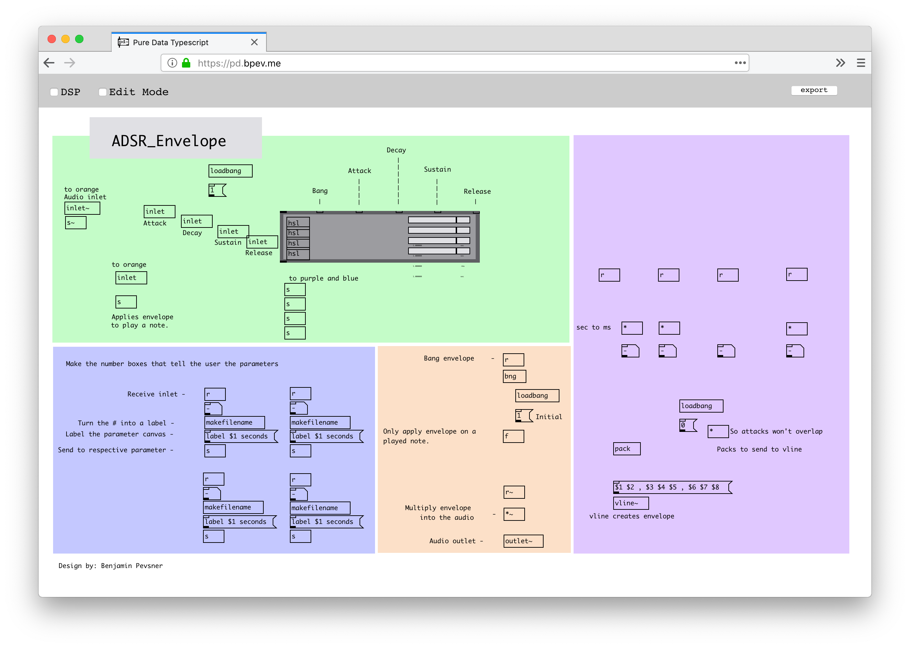

WIP Don't expect anything to work.

# Pure Data Web
A complete web implementation of Pure Data, using [Typescript](https://www.typescriptlang.org/), [Canvas API](https://developer.mozilla.org/en-US/docs/Web/API/Canvas_API), and [Web Audio API](https://developer.mozilla.org/en-US/docs/Web/API/Web_Audio_API).

Inspired by [Pure Data](https://puredata.info/), [WebPd](https://github.com/sebpiq/WebPd), and [PD-Fileutils](https://github.com/sebpiq/pd-fileutils), this project is looking to build upon those by implementing a completely functional gui, so that you can import *.pd files, edit them, listen to them, then export them as *.pd. We will also export the javascript utilities used to construct it as npm modules. This will allow us to use Pure Data to create web audio applications and patches. Pure Data the application is already great at things like live performance/coding, and creating fun sounds. The goal of this is to make it easier to make edits to patches on the fly, and to make it easier to share patches and ideas. The dream is to be able to make it trivial to use running Pure Data patches as embedded examples in a blog post, or as the core of a web-audio application with a custom gui.

# How to run
```sh
yarn
yarn start
# Open on http://localhost:8080/
```

# Other Relevant Links/Resources
- [Pure Data Downloads/Source](http://msp.ucsd.edu/software.html)
- [Pure Data Github Mirror](https://github.com/pure-data/pure-data)
- [Pure Data FLOSS Manual](http://write.flossmanuals.net/pure-data)


